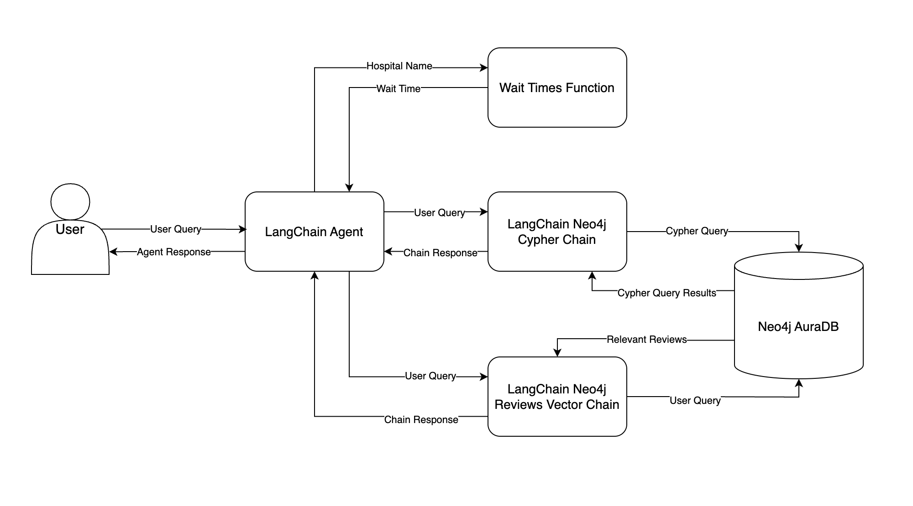

# Chatbot-RAG  

This is a project that showcases how to build a custom Retrieval-Augmented Generation (RAG) chatbot using LangChain. The chatbot is designed to address business requirements and integrate hospital system data, leveraging Neo4j AuraDB to efficiently retrieve both structured and unstructured data. By utilizing graph databases, it ensures accurate and context-aware responses. The project also includes setting up a Neo4j instance, designing the chatbot, and deploying it using FastAPI and Streamlit for an interactive user experience.  

The architecture of the project is as follows:  
